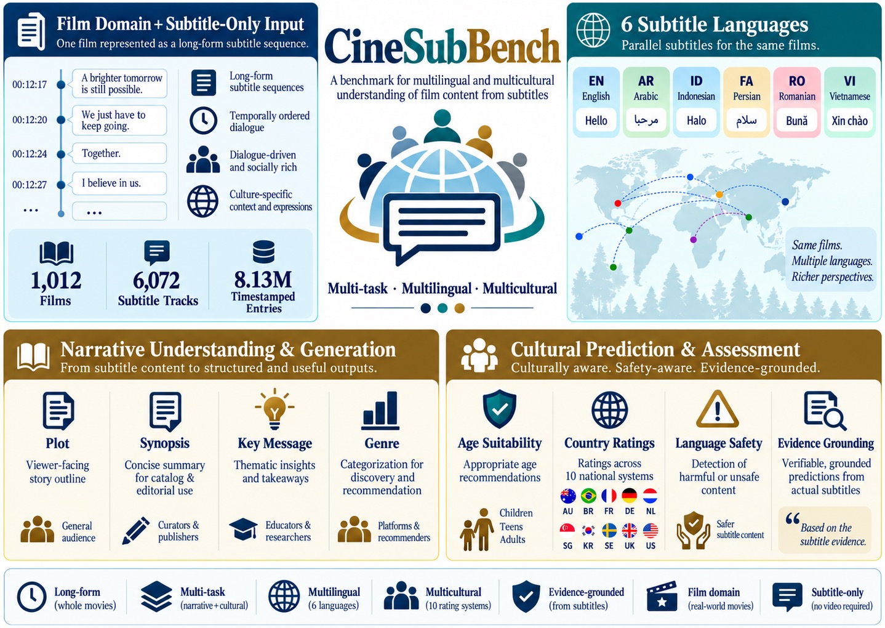

# CineSubBench

CineSubBench evaluates whether language models can reconstruct a film's story and make culturally situated judgments from film-length subtitles. Its 1,012 films have complete coverage in six subtitle languages and ten national motion-picture rating systems: 6,072 tracks and 8.13 million timestamped entries. The same films support matched comparisons across tasks, languages, and countries.

<p align="center"><a href="assets/figure1_overview.jpg"></a></p>

*Figure 1. Overview of CineSubBench. The same 1,012 films support matched multi-task, multilingual, and multicultural evaluation.*

Subtitle timestamps preserve order, but do not identify speakers, scenes, events, motivations, or causal links. Models must recover these from short, dialogue-centered utterances distributed across the film. The benchmark tests seven tasks in two groups:

| Task group | Tasks |
|---|---|
| Narrative understanding and generation | Plot, spoiler-aware synopsis, key message, and multi-label genre prediction |
| Cultural prediction and assessment | Age suitability, country-specific motion-picture ratings, and subtitle-grounded language-safety assessment |

The first six tasks can be compared across subtitle languages; language-safety evidence is evaluated on the English track. This repository contains the evaluation code, OpenAI/Gemini/Anthropic adapters, prompts, schemas, and a 20-film sample. The complete dataset is on Hugging Face.

## Dataset
<p><a href="https://huggingface.co/datasets/tafseer-nayeem/CineSubBench"> <strong>tafseer-nayeem/CineSubBench</strong></a> · Complete dataset on Hugging Face</p>

Load the complete benchmark directly from Hugging Face:

```python
from datasets import load_dataset

dataset = load_dataset("tafseer-nayeem/CineSubBench", split="test")
```

The included [`dataset/CineSubBench.sample20.json`](dataset/CineSubBench.sample20.json) is for inspecting the format and testing the pipeline without downloading the complete dataset. The [dataset guide](dataset/README.md) describes construction, fields, and source provenance.

## Code coverage

Inference is provided for:

- OpenAI
- Google Gemini
- Anthropic

Open-weight and local-model inference code is not included. The evaluator is model-independent and can score predictions produced elsewhere when they follow the bundled schemas.

## Installation

```bash
python -m venv .venv
source .venv/bin/activate
pip install -r requirements.txt
cp .env.example .env
```

Set only the key needed for a run:

```bash
export OPENAI_API_KEY="..."
export GEMINI_API_KEY="..."
export ANTHROPIC_API_KEY="..."
```

Keys are read from environment variables. They are never stored in model configuration files or written to run outputs.

## Shared decoding settings

Every provider uses the same benchmark policy:

| Task | Temperature | Maximum output tokens |
|---|---:|---:|
| Narrative generation | 0 | 1,200 |
| Cultural prediction | 0 | 1,400 |
| Language-safety assessment | 0 | 2,500 |
| Narrative judging | 0 | 4,096 |

Provider adapters translate these values to each API's parameter names. Model configuration files contain provider and execution details only, preventing model-specific decoding drift.

## Check the setup

This command validates the dataset and configuration without sending an API request:

```bash
python -m cinesubbench doctor \
  --model-config configs/models/openai.yaml
```

The complete Hugging Face `test` split is the default dataset. Add `--require-key` to check that the corresponding environment variable is set. For a quick local smoke test without downloading the full dataset, add:

```bash
--dataset dataset/CineSubBench.sample20.json
```

## Batch generation

First prepare requests locally:

```bash
python -m cinesubbench prepare \
  --model-config configs/models/openai.yaml \
  --task narrative \
  --language en \
  --run-dir runs/openai_narrative_en
```

Review `requests.jsonl` and `run_info.json`, then submit:

```bash
python -m cinesubbench submit \
  --model-config configs/models/openai.yaml \
  --run-dir runs/openai_narrative_en \
  --confirm
```

Check and collect the results:

```bash
python -m cinesubbench status \
  --model-config configs/models/openai.yaml \
  --run-dir runs/openai_narrative_en

python -m cinesubbench collect \
  --model-config configs/models/openai.yaml \
  --run-dir runs/openai_narrative_en \
  --output results/openai_narrative_en.json
```

Change only the model configuration to run Gemini or Anthropic. The same workflow supports `narrative`, `cultural`, and English-only `language_content`. Language-content requests use non-overlapping blocks of 500 subtitle entries and are combined into one film-level output only when every block succeeds.

Direct execution is also available with a configuration whose `execution.mode` is `direct`. It requires an explicit `--confirm` flag.

## Run files

Prepared requests are saved as JSONL and run information as JSON. Collected predictions, failures, and recovery details are also JSON. Metric summaries and leaderboard calculation details are JSON, while the leaderboard itself is CSV. The code does not generate Markdown reports.

For the chunked language-content task, `partialOutputs` retains successful chunks so a failed chunk can be repaired without repeating successful API requests. Film-level outputs are emitted only after all expected chunks are available.

## Narrative judging

Narrative generation quality is evaluated with the bundled rubric. Supply the candidate narrative output:

```bash
python -m cinesubbench prepare \
  --model-config configs/models/openai.yaml \
  --task narrative_judge \
  --language en \
  --predictions results/openai_narrative_en.json \
  --run-dir runs/openai_narrative_en_judge
```

Submission and collection use the same commands as other tasks.

## Evaluation

The evaluator reports:

- Plot, synopsis, key-message, and narrative-overall judge scores
- Genre exact match, micro precision/recall/F1, macro-F1, and Jaccard
- Age exact match, within one year, within two years, and MAE
- Country-rating exact match, ordinal MAE, and valid-label rate
- LC count MAE, category-agnostic evidence precision/recall/F1, and strict category evidence F1
- Narrative length compliance

The JSON result also includes per-genre, per-country, per-language-content-category, narrative-rubric, and structured error-type breakdowns.

Each supplied task also receives a completion percentage. The composite leaderboard excludes incomplete runs.

```bash
python scripts/evaluate.py \
  --model "Example Model" \
  --language en \
  --narrative results/narrative_en.json \
  --cultural results/cultural_en.json \
  --language-content results/language_content_en.json \
  --judgments results/narrative_judgments_en.json \
  --output results/metrics_en.json
```

Omit task files that are not being evaluated.

Generation, judging, and evaluation use `hf://tafseer-nayeem/CineSubBench?split=test` by default. Pass `--dataset` or `--gold` only to use a different local or Hub dataset.

## Composite leaderboard

The leaderboard accepts any number of metric summaries and includes only models with complete coverage for the requested languages and English LC Assessment:

```bash
python scripts/calculate_leaderboard.py \
  --metrics results/*_metrics_*.json \
  --output results/leaderboard.csv
```

The accompanying `.calculation_details.json` file records the component values and exact calculation:

```text
normalized_narrative = 25 * (narrative_overall_1to5 - 1)
normalized_age = 100 * (1 - min(age_mae_years, 16) / 16)
cultural_score = (normalized_age + country_exact_match_pct) / 2
composite_score = mean(
    normalized_narrative,
    genre_micro_f1_pct,
    cultural_score,
    english_lc_strict_f1_pct
)
```

## Structural recovery

Recovery operates only on saved raw responses. It may remove Markdown fences, remove trailing commas, close otherwise valid JSON containers, and normalize documented container aliases. It does not create or change predicted text, labels, evidence indices, or scores.

```bash
python scripts/recover_outputs.py \
  --input results/narrative_en.json \
  --task narrative \
  --output results/narrative_en_recovered.json
```

## License

CineSubBench is available exclusively for non-commercial research under the [Creative Commons Attribution-NonCommercial-ShareAlike 4.0 International License](https://creativecommons.org/licenses/by-nc-sa/4.0/). See [LICENSE](LICENSE).

## Paper

Mir Tafseer Nayeem, Susmoy Chakraborty, and Davood Rafiei. *CineSubBench: Evaluating LLMs on Long-Form Narrative and Cultural Understanding from Multilingual Movie Subtitles*. Preprint, 2026.
