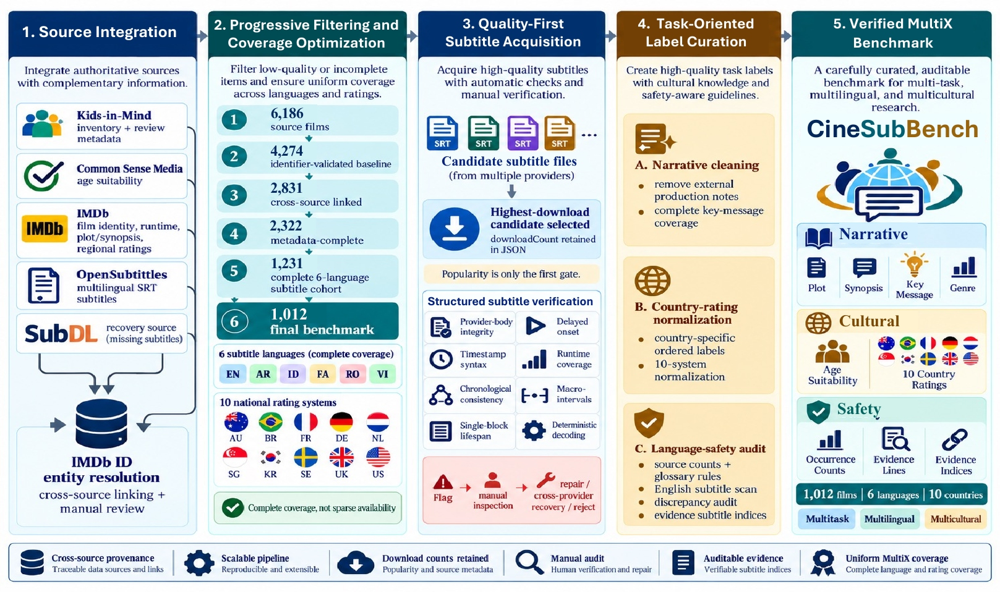

# CineSubBench dataset

CineSubBench is a film-level benchmark for evaluating long-form narrative understanding and culturally situated assessment from multilingual subtitles. Each of its 1,012 films combines narrative references, genre labels, age suitability, ratings from ten national motion-picture classification systems, audited English language-safety evidence, and timestamped subtitles in six languages. Complete coverage over the same films supports matched task, language, and country comparisons.

`CineSubBench.sample20.json` contains 20 examples for inspecting the format and testing the code without downloading the complete benchmark. `SAMPLE_IDS.txt` lists the included film identifiers.

## Complete dataset

The complete dataset is hosted at [**Hugging Face — `tafseer-nayeem/CineSubBench`**](https://huggingface.co/datasets/tafseer-nayeem/CineSubBench).

Load it with the Hugging Face `datasets` library:

```python
from datasets import load_dataset

dataset = load_dataset("tafseer-nayeem/CineSubBench", split="test")
```

The canonical `data/CineSubBench.json` file on Hugging Face and the local sample use the same film-level structure.

The CineSubBench command-line tools also accept the Hub dataset directly:

```bash
python -m cinesubbench doctor \
  --model-config configs/models/openai.yaml \
  --dataset 'hf://tafseer-nayeem/CineSubBench?split=test'
```

This Hub URI is the default dataset source for `doctor`, `prepare`, `run`, and `evaluate`; it can therefore be omitted for standard full-benchmark runs.

## Construction and quality assurance

<p align="center"><a href="assets/figure2_construction.jpg"></a></p>

*Figure 2. Cross-source film linking and progressive filtering are followed by complete-coverage optimization, subtitle verification, and task-specific reference curation. Click to inspect the full-size figure.*

The process begins with 6,186 films and links Kids-in-Mind, Common Sense Media, and IMDb records through IMDb title identifiers. Metadata and coverage filtering yield 2,322 metadata-complete films, then 1,231 films with subtitles in all six selected languages. Requiring ratings in all ten selected national systems produces the final 1,012-film benchmark.

When several subtitle files are available for a film and language, source-reported download count prioritizes a candidate; it is not treated as proof of correctness. Structure, timestamps, chronology, runtime coverage, language consistency, and encoding are checked next. Flagged files undergo manual inspection, repair, replacement from another provider, or exclusion. Narrative fields are cleaned for film-internal content, national ratings are normalized within their own label spaces, and English language-safety annotations are checked against external source counts and glossary definitions.

## Subtitle boilerplate sanitization

Subtitle-provider promotions, translator contact details, email addresses, and
similar credit boilerplate are removed from the release files. Original
subtitle indices are retained rather than renumbered, preserving links from
language-content evidence annotations to subtitle entries. The reproducible
cleaner writes a separate output and a content-free audit log:

```bash
python scripts/clean_subtitle_boilerplate.py \
  dataset/CineSubBench.json \
  dataset/CineSubBench.cleaned.json
```

The audit log records affected film, language, subtitle index, reason, and a
hash of the removed content; it does not reproduce contact information.

## Film entity fields

### Identity and film metadata

| Field | Type | Description |
|---|---|---|
| `id` | Integer | Unique sequential film identifier assigned by CineSubBench. |
| `title` | String | Film title used in the benchmark. |
| `releaseYear` | String | Film release year. |
| `duration` | String | Human-readable runtime. |
| `imdbRating` | String | IMDb user-rating value recorded during collection. |
| `countriesOfOrigin` | String | Production country or countries. |
| `originalLanguages` | String | Original spoken language or languages. |
| `directors` | Array of strings | Credited directors. |
| `writers` | Array of strings | Credited writers. |
| `topCast` | Array of objects | Principal cast entries with `actor` and `character`. |
| `fullCast` | Array of objects | Expanded cast entries with `actor`, `characters`, and `additionalTexts`. |

### Narrative and classification references

| Field | Type | Description |
|---|---|---|
| `plot` | String | Concise premise-level narrative reference. |
| `synopsis` | String | Longer, spoiler-aware account of the narrative arc. |
| `storyline` | String | Short source-provided storyline description. |
| `keyMessage` | String | Reference statement of the principal theme or lesson. |
| `genres` | Array of strings | Gold multi-label genre set. |
| `topics` | String | Source-provided topical descriptors. |
| `ageSuitabilityRating` | String | General age threshold, such as `13+`. |
| `motionPictureRatings` | Array of objects | Ratings for ten national systems. Each item contains `country` (String), `label` (String), `minimumAge` (Integer), and `ordinal` (Integer). |

### Language-content assessment

| Field | Type | Description |
|---|---|---|
| `languageContentReference` | Object | External review information retained for audit: `rating` (Integer), `summary` (String), and `source` (String). |
| `languageContentAssessment` | Object | Audited annotations derived from the English subtitle track. It contains `inputLanguage` and four entries under `categories`: `strongProfanity`, `crudeBodilyLanguage`, `mildObscenity`, and `religiousProfanityAndExclamation`. |
| `occurrenceCount` | Integer | Number of matched expressions within one category. |
| `evidenceLineCount` | Integer | Number of distinct subtitle entries containing evidence for that category. |
| `evidenceSubtitleIndices` | Array of integers | Indices linking category evidence to English subtitle entries. |

The final three fields above occur inside each category object in `languageContentAssessment.categories`.

### Sources and multilingual subtitle input

| Field | Type | Description |
|---|---|---|
| `sources` | Object | Per-film provenance URLs stored as `imdbLink`, `commonSenseLink`, and `kidsInMindLink`. |
| `subtitles` | Array of objects | Six subtitle tracks: English, Arabic, Indonesian, Persian, Romanian, and Vietnamese. Each track contains `language`, `downloadCount`, and `entries`. |
| `language` | String | Track language in `Language name (code)` form. |
| `downloadCount` | Integer | Provider download count retained as a candidate-selection signal before further quality checks. |
| `entries` | Array of objects | Ordered subtitle units containing `index` (Integer), `timeframe` (String), and `content` (String). |

The last three fields occur inside each object in `subtitles`.

## Source mapping

| Source | Dataset fields |
|---|---|
| [Common Sense Media](https://www.commonsensemedia.org/) | `ageSuitabilityRating`, `storyline` |
| [Kids-in-Mind](https://kids-in-mind.com/) | Initial film inventory, `keyMessage`, and `languageContentReference`; counts and glossary definitions used to audit subtitle-derived `languageContentAssessment` |
| [IMDb](https://www.imdb.com/) | `title`, `releaseYear`, `duration`, `imdbRating`, `countriesOfOrigin`, `originalLanguages`, `genres`, `topics`, `plot`, `synopsis`, `motionPictureRatings`, `directors`, `writers`, `topCast`, and `fullCast` |
| [OpenSubtitles](https://www.opensubtitles.com/) and [SubDL](https://subdl.com/) | Multilingual subtitle tracks and timestamped entries; SubDL is also used for recovery |

## Evaluation notes

Genre evaluation maps documented IMDb subgenres and spelling variants to the benchmark's broad genre inventory. Unsupported predicted labels count as false positives. Country-rating ordinal error is calculated over each country's declared benchmark label order, ensuring that an exact label match has zero error.

The 20-example file is intended for format inspection and pipeline testing. Benchmark results should be calculated from the designated evaluation data, not from this sample.

The data are provided for non-commercial research under CC BY-NC-SA 4.0. See the repository-level `LICENSE` file.
